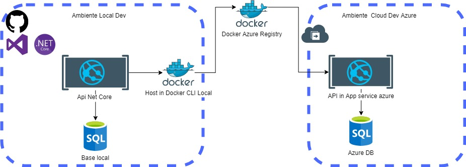
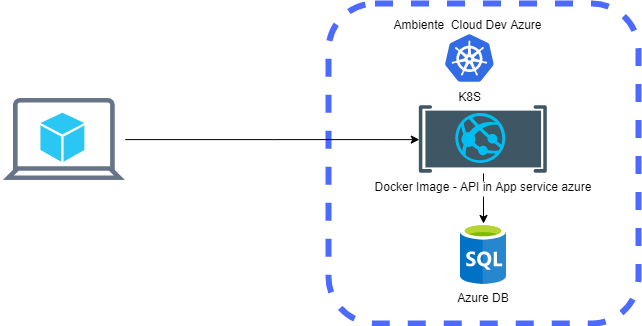

# SV Challenge
# Arquitectura SuperVielle Challenge
En base a los atributos de calidad la solución está preparada para poder lograr subir un contenedor con la solución API en un entorno Kubernetes o cualquier orquestador. 
En la siguiente arquitectura podemos ver el host en AZURE del contenedor de la API y también de la base de datos. 



# Resumen de arquitectura entorno desarrollo



# Escenario básico
## 1-Pasos para la instalación : 
Descargar el proyecto de github:
Ejecutar en su consola git:
```git
$ git clone https://github.com/rodrigoarias12/SVChallenge
```
## 2-Abrir el proyecto con visual studio. 
## 3-Desde la consola de visual studio se ejecuto la siguiente sentencia para migrar la base a un script.
```
gitdotnet ef migrations script --output "script.sql" --project Persona.API
```
Puede ejecutar el siguiente script en su motor de base local 
## 4-Abrir el archivo appsettings y poner la cadena de conexión.
En myDb1
## 5-Ejecutar en modo Docker o modo iisserver
